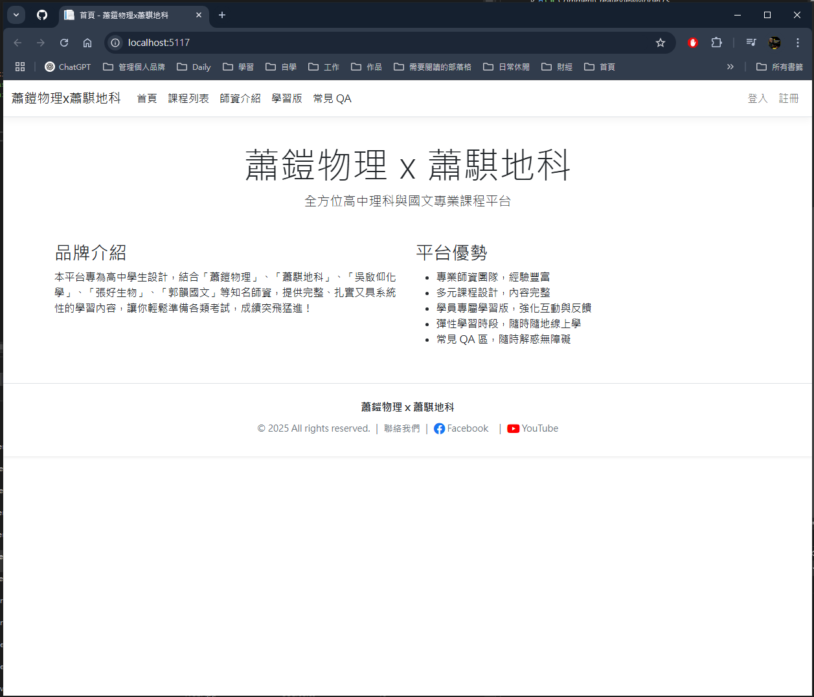
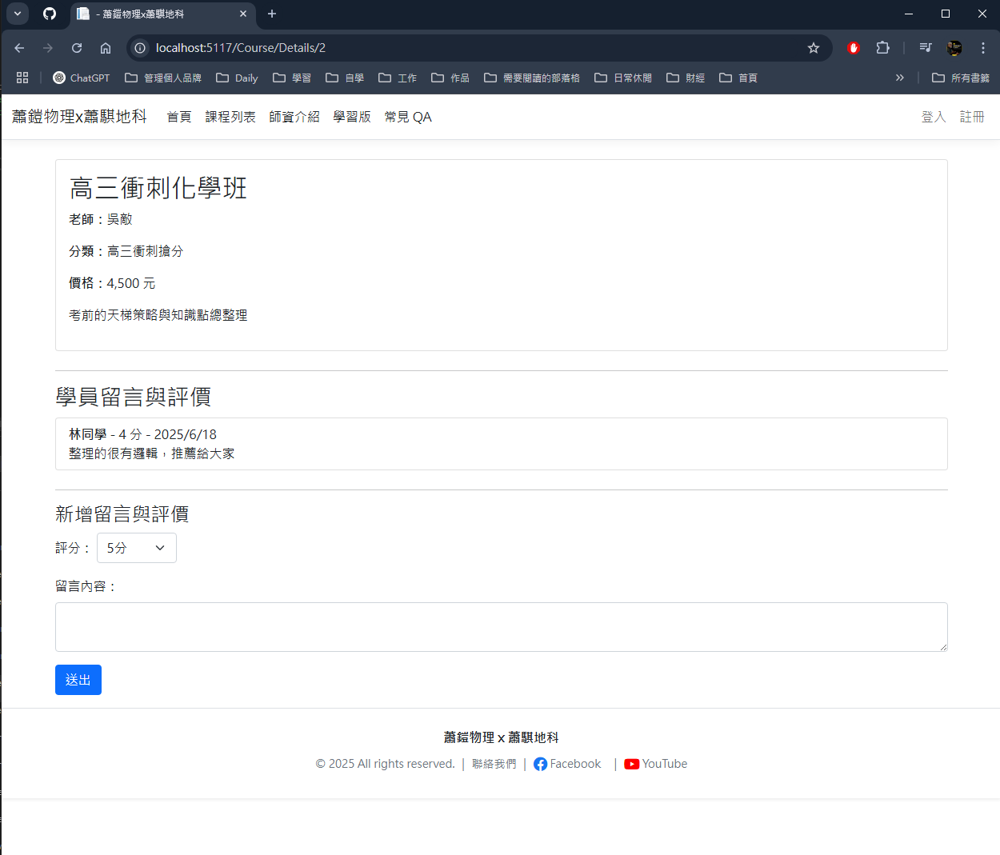

## 快速開始

1. **Clone 專案**
    ```bash
    git clone https://github.com/你的帳號/你的專案.git
    cd 你的專案資料夾
    ```

2. **設定資料庫連線字串**
    - 修改 `appsettings.json`，填入本地或雲端 MSSQL 連線資訊

3. **套用資料庫建表與範例資料**
    - 可參考 `/docs` 內 SQL 指令或提供的 `.sql` 檔

4. **執行專案**
    ```bash
    dotnet run --project WebApp
    ```

5. **瀏覽網站**
    - 開啟瀏覽器至 [http://localhost:xxxx](http://localhost:xxxx)

## 部署說明

- 可直接部署至 Azure App Service、AWS Elastic Beanstalk 等雲平台
- 資料庫可用本地 MSSQL Express、Azure SQL、AWS RDS (SQL Server Express)

## DEMO 截圖

>   
> 

---

## 作者

- Tedliu ([GitHub](https://github.com/qsc811022))

---
graph TD
    Client[使用者瀏覽器]
    WebApp[ASP.NET Core MVC\n(控制器/檢視/模型)]
    Dapper[Dapper ORM\n資料存取層]
    Database[SQL Server\n(課程/老師/留言/FAQ等資料表)]

    Client <--> WebApp
    WebApp --> Dapper
    Dapper --> Database

    subgraph WebApp
        Course[課程管理]
        Teacher[老師介紹]
        Comment[留言評價]
        FAQ[常見問題]
        Auth[登入註冊/權限]
    end

    WebApp --> Course
    WebApp --> Teacher
    WebApp --> Comment
    WebApp --> FAQ
    WebApp --> Auth

如有技術問題歡迎提問或 Issue！
